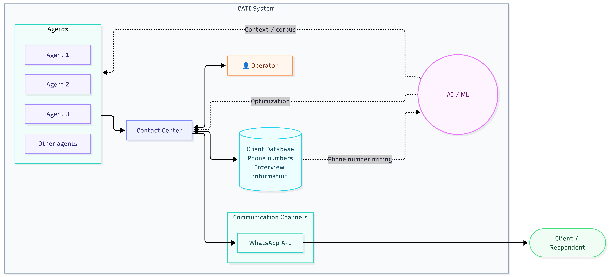
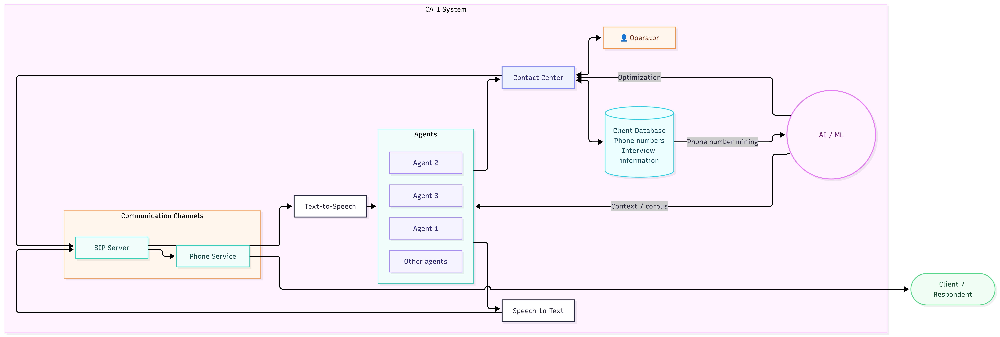

# Semana 3 - 29/09/2026 - 06/10/2026

# Notebook - Abel Teixeira 113655

✅ - Tarefa Realizada
⏳ - Tarefa Por Realizar

### Tarefas Realizadas

| **ID** | **DESCRIÇÃO**                                        | **ESTADO** |
| ------ | ---------------------------------------------------- | ---------- |
| 7      | Criar um diagrama com a arquitetura inicial          | ✅         |
| 8      | Investigar sobre tecnicas de entrevista por telefone | ⏳         |
| 9      | Investigar sobre sistemas CATI                       | ⏳         |
| 10     | Criar um repositorio com projeto inicial             | ⏳         |

### Tarefas a Realizar

| **ID** | **DESCRIÇÃO**                                        | **ESTADO** |
| ------ | ---------------------------------------------------- | ---------- |
| 11     |          | ⏳         |

### Notas Adicionais

Diagramas para a arquitetura inicial do sitema e para a arquitetura com o SIP Server para efetuar as chamadas.

<figure>
  
  <figcaption>Figura 1: Arquitetura Inicial do Sistema</figcaption>
</figure>

<figure>
  
  <figcaption>Figura 2: Arquitetura com o SIP Server para efetuar as chamadas</figcaption>
</figure>

### Referências
